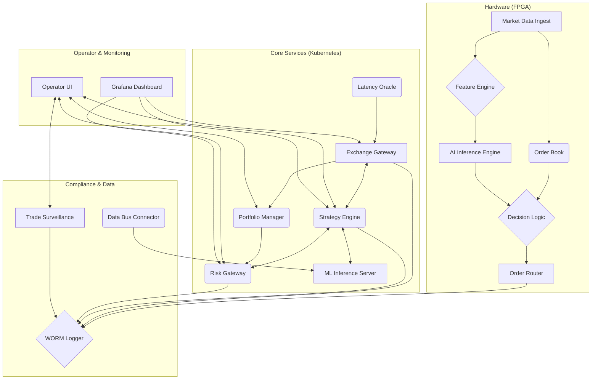

# QuantumArb 2.0

**An AI-Accelerated, Quantum-Ready Arbitrage Platform for the Next Decade of Finance.**

---

## Mission

To engineer the world's most advanced, resilient, and intelligent cross-asset arbitrage system. QuantumArb 2.0 is designed from the ground up to achieve deterministic, ultra-low-latency performance while pioneering the use of AI and quantum computing in financial markets.

---

## Core Architecture

The platform is built on a cloud-native, microservices architecture designed around four key pillars:

* **Latency:** An obsessive focus on speed, targeting **sub-100 microsecond tick-to-trade** latencies. This is achieved through a hybrid hardware/software approach, bypassing kernel and OS-level overheads for all critical path operations.

* **Intelligence:** A multi-layered AI stack that moves beyond simple automation. It combines a real-time, on-FPGA inference engine for nanosecond-level predictions with a sophisticated ML pipeline for training advanced models on both market and alternative data.

* **Resilience:** An active-active, geographically distributed deployment designed for zero-downtime and sub-30-second disaster recovery failover, meeting and exceeding **Reg-SCI** standards. System integrity is continuously validated through automated Chaos Engineering.

* **Compliance:** A comprehensive, end-to-end risk and compliance framework. From pre-trade hardware risk checks and real-time VaR calculations to post-trade surveillance for manipulative patterns, every action is logged to an immutable, audit-ready WORM store.

---

## System Components

QuantumArb 2.0 is a collection of specialized, high-performance services working in concert.

* **FPGA Core:** The heart of the low-latency path, handling order book management, feature calculation, and AI inference in hardware.
* **Strategy Engine:** The central decision-making service, equipped with a Smart Order Router (SOR) and integrated with the ML pipeline.
* **Risk Gateway:** Provides real-time, pre-trade risk checks using a shared Redis state.
* **VaR Calculator:** Runs Monte Carlo simulations to calculate portfolio-wide Value at Risk.
* **Exchange Gateway:** Manages connectivity to exchanges, dynamically routing orders via the fastest path determined by the **Latency Oracle**.
* **Portfolio Manager:** The source of truth for all positions and P&L.
* **ML Pipeline:** A complete suite for data processing, model training (`XGBoost`), and serving (`FastAPI`).
* **Quantum Sandbox:** An environment for prototyping QAOA-based portfolio optimization.
* **Compliance Suite:** Includes the **WORM Logger** for immutable audit trails and the **Trade Surveillance Service** for detecting manipulative patterns.

---

## Technology Stack

* **Core Services:** Rust (Tokio)
* **ML & Quantum:** Python (FastAPI, XGBoost, Pandas, AWS Braket)
* **Hardware:** SystemVerilog (for FPGA logic), C++ (for High-Level Synthesis)
* **Networking:** C (DPDK for kernel bypass)
* **Infrastructure:** Terraform, AWS (EKS, EC2, S3)
* **Deployment:** Docker, Kubernetes, Helm, ArgoCD (GitOps)
* **CI/CD:** GitHub Actions
* **Service Mesh:** Istio (for mTLS)
* **State & Messaging:** Redis, NATS (conceptual)

---

## Features

* **On-Chip AI:** A hardware-implemented decision tree for nanosecond-level predictive signals.
* **Smart Order Routing (SOR):** Intelligently splits orders across venues to minimize slippage and achieve best execution.
* **Dynamic Path Arbitration:** A Latency Oracle service ensures orders are always sent on the fastest network path (Microwave vs. Fiber).
* **Real-time VaR:** Monte Carlo-based Value at Risk calculations provide a sophisticated, live view of market risk.
* **End-to-End Compliance:** From pre-trade checks to post-trade spoofing detection, the platform is built for regulatory scrutiny.
* **Quantum Optimization:** A fully integrated QAOA portfolio optimizer demonstrates readiness for next-generation financial modeling.
* **Unified Operator Command Center:** A single UI provides real-time control over strategies, risk, portfolio performance, and compliance alerts.

---

## Getting Started

Deployment of the QuantumArb 2.0 platform is fully automated:

1.  **Configure AWS:** Set up AWS credentials for Terraform and the CI/CD pipeline.
2.  **Provision Infrastructure:** Run `terraform apply` to build the VPC and EKS cluster.
3.  **CI/CD Pipeline:** Pushing code to the `main` branch will trigger the GitHub Actions workflow, which builds, tests, and containerizes all services.
4.  **GitOps Deployment:** ArgoCD detects changes in the Helm charts within the repository and automatically deploys or updates the services on the EKS cluster.

---

## Project Status

**Functionally Complete (Conceptual):** All core and advanced features outlined in the project plan have been implemented, packaged, and integrated. The platform is ready for performance tuning, live data integration, and production hardening.

---

## Contributing & Governance

Contributions are welcome. All development must adhere to the project's coding standards and pass all automated CI checks. All algorithmic changes are subject to a governance model based on FINRA best practices.

---

## License

The core of QuantumArb 2.0 is open-source under the **Apache 2.0 License**. Proprietary low-latency plugins, advanced AI models, and specific exchange connectors are licensed separately.
